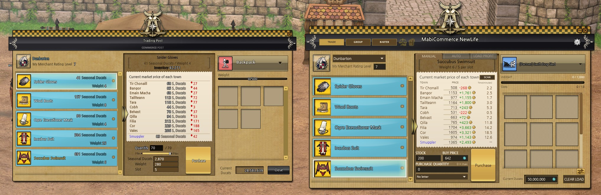
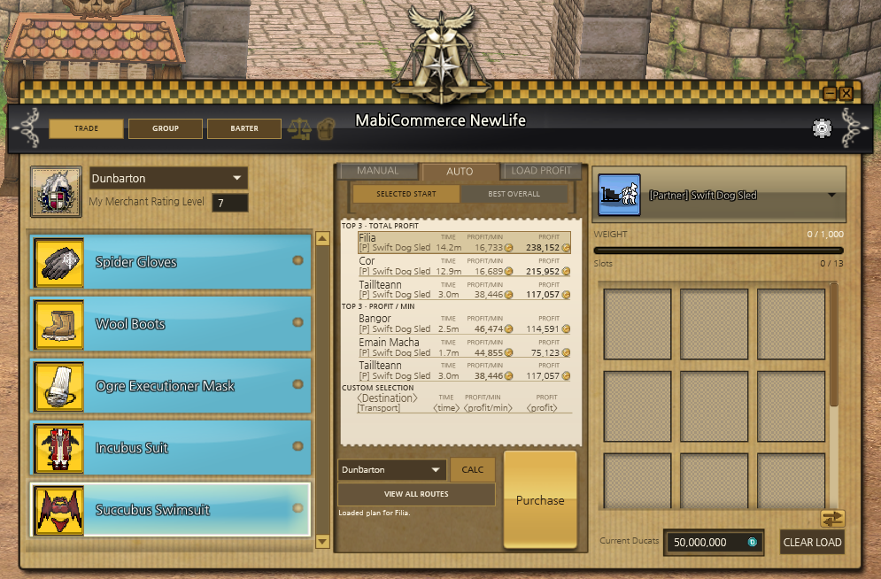
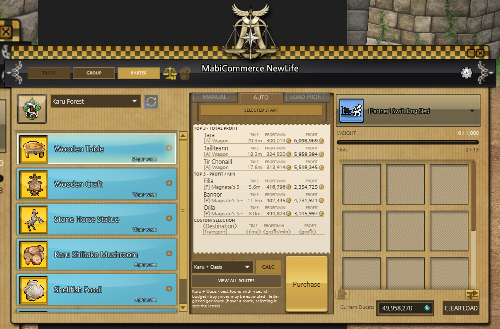
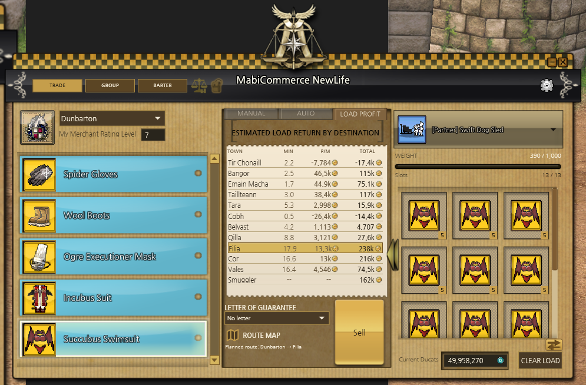

# MabiCommerce NewLife

A Windows desktop planner for Mabinogi commerce (C# / WPF, .NET 9). Enter or scan prices, plan loads, and compare profit, travel time and Gold per minute across trading posts.

The window recreates the in-game Trading Post using art, icons and fonts taken from the game client.

## Screenshots

**Manual**



**Auto**



**Barter**



**Load Profit**



## Features

- **Trade, Group and Barter** pages, each with its own goods list, transport load and stock.
- **Manual** tab: edit buy and sale prices; see per-item profit and travel time.
- **Auto** tab: ranks the best destinations or routes by total profit and profit per minute.
- **Load Profit** tab: profit, time and Gold per minute for every destination for your current load.
- **Screen scan (OCR)**: press SCAN, select the price list on screen, and the prices are read in. Readings that don't cross-check are shown for review before they're applied.
- **Route map overlay**: draws your route on the game's minimap, step by step across regions.
- **Modifiers**: Commerce Mastery, Letters of Guarantee, merchant ratings, accessory enchants, speed buffs and other bonuses.
- **Transports**: choose which you own; partner and Alpaca variants are optional.
- **Weekly reset**: Group and Barter stock can refill automatically at the Thursday reset.
- **Barter materials**: track what you have and copy the shopping list as a table to paste into Google Sheets.
- **Trade history** (in Settings): a log of every load sold with the Sell button, with running totals of raw Gold, Ducats and converted total Gold.

Settings, prices and transport choices are saved in `config.json` beside the exe; trade history is in `trade-history.json` beside it. Use a writable folder. Copy these files when upgrading to keep your settings.
New profiles start with editable reference material and guarantee-letter values; existing saved values are kept.
Each app folder has its own profile; older AppData settings are not imported.

## What it does not do

It never connects to the game, reads its memory, captures packets or modifies the client. Screen capture only happens when you press SCAN, and only on the region you select. Captured images are not saved.

This tool makes no claim about compatibility with Mabinogi's rules or anti-cheat. Follow the game's current terms.

## Limitations

- Prices are whatever you enter or scan; nothing is live.
- Travel times are estimates from client map data and the ship schedule. Some regions have no route data.
- Barter rotations, exchange quantities and some bonus values still need in-game checking.

## Install

Download the zip from [Releases](https://github.com/Root50199/MabiCommerceNewLife/releases), extract it anywhere and run `MabiCommerceNewLife.exe`. Keep the `Data` and `x64` folders next to the exe. No .NET install is needed; screen scan (OCR) needs the [Microsoft Visual C++ Redistributable (x64)](https://aka.ms/vs/17/release/vc_redist.x64.exe).

## Build

Requires the .NET 9 SDK on Windows.

```powershell
dotnet build
dotnet publish -c Release   # single self-contained exe in bin\Release\net9.0-windows\win-x64\publish
```

## Tests

```powershell
dotnet test .\CalculatorTests\CalculatorTests.csproj
```

OCR tests use your own screenshots, which are not in the repo. See [CalculatorTests/Fixtures/README.md](CalculatorTests/Fixtures/README.md).

## Contributing and releases

Work on `dev`; merge into protected `main` through a pull request after **Build and test** passes. Dependency updates also target `dev`.

For a release, update the project version on `dev`, merge to `main`, then push a matching tag (for example `v0.2.0-beta.1`). Actions builds, tests and publishes the Windows zip and SHA-256 checksum. Tags with a suffix are pre-releases. For local packaging, run `.\tools\Package-Release.ps1`.

## Data

`Data/` holds the goods catalog, client UI art, fonts, route maps and the OCR model (Tesseract `tessdata`, Apache-2.0). To rebuild the catalog from a local client dump (requires ImageMagick):

```powershell
.\tools\Import-CommerceCatalog.ps1 -ClientDataRoot <path>
```

## Special Thanks

- [MabiCommerce](https://github.com/Xcelled/mabicommerce) by Xcelled: the original Mabinogi commerce calculator and the inspiration for this project.
- [Mabioned](https://github.com/exectails/Mabioned) by exectails: its region and collision readers made it possible to map the trade routes.
- [Tesseract OCR](https://github.com/tesseract-ocr/tesseract) and the [TesseractOCR](https://github.com/Sicos1977/TesseractOCR) .NET wrapper: power the price scanner.
- [Mabinogi World Wiki](https://wiki.mabinogiworld.com/): commerce mechanics, transport speeds and reward formulas.
- Naver: the Nanum Gothic font.

## License

The source code is released under the [MIT License](LICENSE). Third-party components keep their own licenses; see [THIRD-PARTY-NOTICES.txt](THIRD-PARTY-NOTICES.txt).

Mabinogi and its game assets are © Nexon. Art, icons, maps and names taken from the game client are not covered by the MIT License. This project is not affiliated with or endorsed by Nexon.
